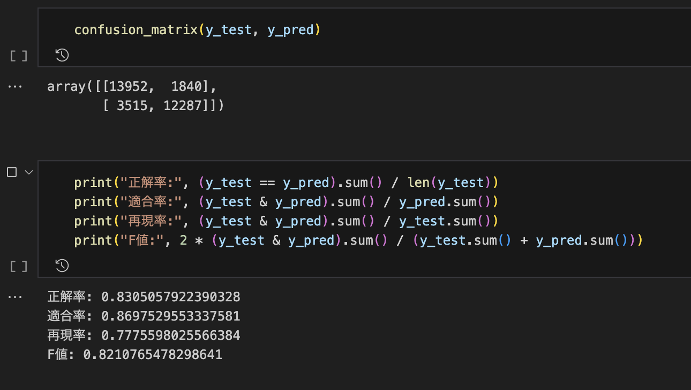
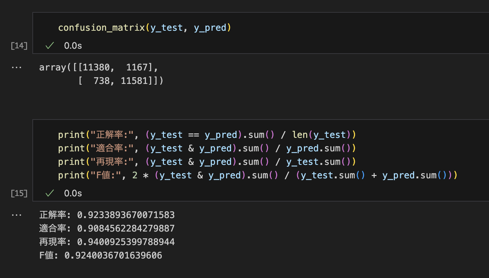

# ダジャレ判定器

使用技術: Google Cloud, Python, 機械学習

# Notion

Notionにもこちらと同様の説明があります。（Notionのほうが見やすいと思います）

[こちらからどうぞ！](https://ayu0616.notion.site/ae41960de3584e8c9559978d135db670?pvs=4)

# 概要

- **大学のゼミ**の研究課題として制作中
- 作成時期：大学3年生の前期（現在制作中）
- 使用言語：**Python**
- ある日本語の文章が**駄洒落かどうかを判定**する
- サポートベクターマシンなど**機械学習**の手法を使って行う
- 先行研究を追試しているところ
    - 先行研究：[子音の音韻類似性及びSVMを用いた駄洒落検出手法 (jst.go.jp)](https://www.jstage.jst.go.jp/article/jsoft/28/5/28_875/_article/-char/ja/)
- 先行研究の再現が完了したら、自分なりに改善していく予定

# 駄洒落

今回の研究では、以下で説明する**併置型駄洒落**のみを分類の対象とする。

## 併置型駄洒落

**併置型駄洒落**には**種表現**と**変形表現**と呼ばれる部分がある。

**自立語やその句**が種表現になりうる。変形表現は文章の任意の区間の音素列がなりうる。種表現と変形表現はその音が完全に同じもしくは非常に類似していなければならない。

### Perfect

併置型Perfectの駄洒落とは、「アルミ缶の上にある蜜柑」の「アルミ缶」と「ある蜜柑」のように異なる区間の音素列が**全く同じ音**である駄洒落のことを表す。

### Imperfect

併置型Imperfectの駄洒落とは、「ふとんが吹っ飛んだ」の「ふとん」と「吹っ飛ん」のように異なる区間の音素列が**部分的に同じ音**である駄洒落のことを表す。

促音の挿入のほか、子音が一部変化するパターンもこれに含まれる。「機械学習を学ぶ気概に溢れている」の「機械（ki, **k**a, i）」と「気概（ki, **g**a, i）」がその例である。

## 重畳型駄洒落

重畳型駄洒落とは、「すいま千羽鶴」のように、種表現と変形表現を持たない駄洒落である。

音韻的な特徴がなく、意味によって解釈されるものであるため、コンピューターで工学的に処理することが難しい。

# 研究の経過

## 先行研究探し（4月）

先行研究としては、先述の[子音の音韻類似性及びSVMを用いた駄洒落検出手法 (jst.go.jp)](https://www.jstage.jst.go.jp/article/jsoft/28/5/28_875/_article/-char/ja/)が自分のやりたいことと全く同じだった。したがってそれを再現するのが当面の目標となった。

その他の研究

- [Transformerを用いた日本語併置型駄洒落の自動生成](https://www.anlp.jp/proceedings/annual_meeting/2021/pdf_dir/B3-4.pdf)
    - こちらは生成モデルの論文
    - 自分にはまだ理解できなかった
    - いずれ駄洒落の生成ができるようになりたい

## 先行研究の再現開始（5月）

先行研究にしたがって自分の環境でモデルを作成してみることにした。

日本語の文章をそのままSVMで分析する訳はいかないので、数字で表せる何らかの**特徴量を抽出**しなければならない。

先行研究で使用されていた特徴量

- **Bag of Words**
    - 文章中に含まれる単語の出現回数を表す
    - 単語の種類は2万を超えるので、次元削減が必要（後述）
- **読み仮名列完全一致**
    - 読み仮名が完全に一致する部分があれば1なければ0
    - 種表現候補の自立語のそれぞれに対して、文章中で自身以外に読み仮名が一致する部分があるかどうかを調べる。一単語でもそのようなものが存在すれば、1を返す
- **子音の音韻類似度スコア**
    - 再現の際、最も苦戦した
    - ざっくり説明すると、文章中の任意の子音ペアに対して、コーパスにおけるそのペアの出現確率とその文章の死因ペアの出現確率の比を足し合わせたものと思われる
    - 自分の解釈で実装したが、駄洒落とそうでないもののスコアにあまり差が出なかった
    - 最終的に使用しなかった（後述）

---

また、学習データは次の方法で入手した。

駄洒落の文章：有志が作成した**Pythonスクリプトによりスクレイピング**した。

[https://github.com/vaaaaanquish/dajare-python](https://github.com/vaaaaanquish/dajare-python)

駄洒落でない文章：**名大会話コーパス**を使用した。

[名大会話コーパス](https://mmsrv.ninjal.ac.jp/nucc/)

音韻的な方法で駄洒落を判定するため、会話コーパス中でノイズとなりうる文章は削除した。具体的には、個人名を伏せるための「F001」のような英数字が入っていたり、「＜笑い＞」などの会話とは関係ない注が付されている文章は削除した。

## 先行研究の再現を進める（6月）

再現を進めているうちにいくつか問題に直面した。

### 問題1：BoWの次元数が多い

まず最初の問題は、**Bag of Wordsの次元数が多い**というもの。

駄洒落とそうでないもの合わせて6万くらいの文章を学習させたため、単語数が2万を超え、自分のPCでは処理しきれなかった。

### 対策1：次元削減

上記の問題に対して次の対策を行った。

1. **主成分分析（PCA）**によって次元削減を行う
    - PCAは次元削減を行う方法として有名
    - 次元数が多すぎて、PCAも動かないという問題が発生（下の2.で解決）
2. **出現回数が少ない単語**を削除する
    - 学習データ全体で出現回数が1回だけの単語はあまり重要でないためこうした単語は無視する
    - これによって次元数が半分より少なくなり、PCAが動くようになった

以上の対策によって自分のPCで処理できる大きさまで縮約できた。

### 問題2：駄洒落の学習データのノイズ

駄洒落データはウェブサイトのスクレイピングにより入手したため、一部**ノイズ**が含まれていた。

ノイズの例

- コメント文
- 重畳型駄洒落
- 日本語と英語の駄洒落
    - 本がブックブック沈んでいる（book）

これらのノイズは今回対象とする併置型駄洒落の判定に悪影響を及ぼすため、削除しなければならない。

### 対策2：ノイズデータの削除

削除する方法

1. **あらかじめ作成したモデルを学習**させ、**駄洒落の文章すべてについて駄洒落かどうか予測**する
2. 「駄洒落でない」と予測された文章をすべて削除する

これによって文章の数が5万弱→3万5千程度に減った。

削除前

削除後

性能の向上は歴然である。

### 問題3：子音の音韻類似度

先行研究に記載があった子音の音韻類似度がしっかりと理解できていないせいで、この特徴量が**分類にあまり寄与していない**気がしていた。

### 対策3：特徴量の統合

**読み仮名列完全一致の特徴量と統合**するようにした。

「イカはいかが」という例文を用いて説明する。

1. 文章から自立語をリストアップする：ここでは`{"イカ", "いかが"}`
2. 各自立語に対して、自身以外に母音が完全に一致している部分はないか探す
    - `"イカ"`：`"いか"`がそれにあたる
    - `"いかが"`：`"イカは"`がそれにあたる
3. 子音を比較して、スコアを計算する
    - `("イカ", "いか")`：子音が完全に一致しているので`score=1`
    - `("いかが", "イカは") -> ((, k, **g**), (, k, **h**))`
        - 現状：$\frac{1}{3}\sum_{i=1}^3{1[s_i= t_i]}$
            - $i$番目の子音が一致していれば1を返す関数の平均
            - `score=0.67`
        - 理想：$\frac{1}{3}\sum_{i=1}^3{sim(s_i, t_i)}$
            - $i$番目の子音についての類似度の平均
            - 類似度は0から1の実数で、同じ子音どうしの類似度は1
            - 類似度関数をどう定義するのかは今後の課題
4. こうして計算されたスコアの最大値を文章全体のスコアとする

また、上記の計算に加えて、種表現の任意の場所に促音、撥音を挿入したものと、種表現に促音、撥音があれば、それを削除したものについても同様の計算をしている。

例：いか→いっか、いかっ、いんか、いかん

## ウェブサイト制作（7月）

せっかく判定モデルを作成したのだから、みんなにも遊んでほしいと思い、**ウェブサイト**を制作することにした。

Pythonの**Flask**というフレームワークを用いて制作した。

モデルはローカルで学習させたものを**pickle**でバイナリファイルにし、それをクラウドにアップロードしている。

[https://github.com/ayu0616/dajare_app](https://github.com/ayu0616/dajare_app)

[駄洒落判定](https://dajare-app-zhqzb2nbkq-an.a.run.app/)

こちらから駄洒落判定ができます！

こちらからでもアクセスできます！

# 悩みどころ

## 駄洒落の定義について

| 文章 | 自分が許容できるか | 広義の駄洒落か |
| --- | --- | --- |
| アルミ缶の上にある蜜柑 | ◯ | ◯ |
| 布団が吹っ飛んだ | ◯ | ◯ |
| カレーは辛え | ◯ | ◯ |
| ギョウザを作れと教唆した | ✗ | ◯ |
| 本がブックブック沈んでいる（book） | ✗ | ◯ |
| ブドウを食べて驚いた。「きょほぉぉぉ～～～！！！」 | ✗ | ◯ |
| 今日はいい天気ですね | ✗ | ✗ |
- 自分の定義では、機械学習を使う必要がなく、ルールベースで判定できそう
- しかし、信念として「ギョウザ⋯」や「ブドウを⋯」は駄洒落だと認めたくない
- そもそも先行研究の論文では、音韻的な駄洒落を対象としていたので、それは自分の定義と合致している

<aside>
💡 結論：上記の併置型駄洒落のみを対象とする

</aside>
