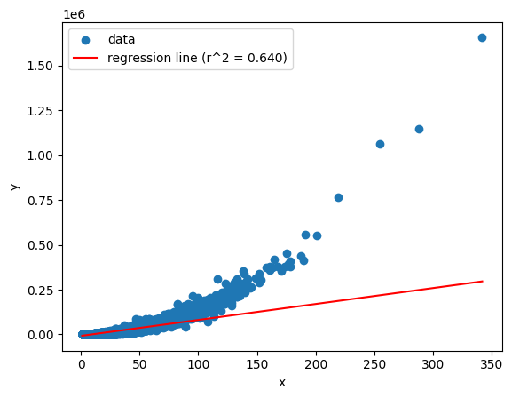
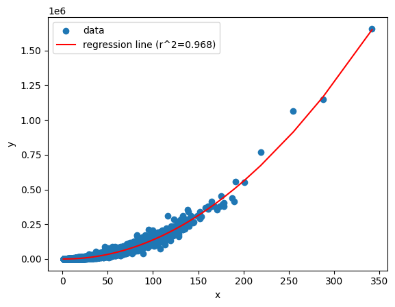
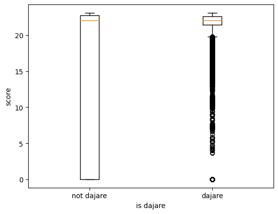

# 学習用の文章を取得する

## 駄洒落

GitHub に良さげなリポジトリがあったので、それを使用する。
(https://github.com/vaaaaanquish/dajare-python)

それにプラスしてhttp://with2.net/dajakuraからもデータを取得した。

## 通常の文

論文には YACIS コーパスを使用したと書いているので、一旦それを検索してみる
→検索したが検索したが見つからなかった

[名大会話コーパス](https://mmsrv.ninjal.ac.jp/nucc/nucc_abst.html)を使ってみることにする

# 子音の音韻類似度

## 文章の長さに依存してスコアが不当に大きくなるおそれあり

予想：文章の長さの 2 乗に比例する

調べてみた

予想通り文章の長さの 2 乗に比例する

## 最大値をとる計算方法

